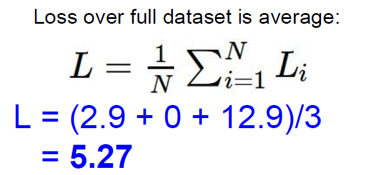

# GOAL
- parameter를 Loss function을 통해 update하는 *optimization* 과정을 이해합니다.
- Gradient descent 과정을 개괄적으로 이해합니다.

# Table of Contents
1. [Loss function](#loss-function)
   - [Multiclass SVM Loss](#multiclass-svm-loss)
   - [Regularization](#regularization)
   - [Softmax function](#Softmax-function)
2. [Optimization](#optimization)
   - [Stochastic Gradient Descent](#stochastic-gradient-descent)

## Loss function
   지난 시간에 우리는 Parameter를 update, 즉 최적의 가중치를 찾아내는 방법에 대한 필요성을 느꼈습니다.
한 마디로 이번 강의에서 설명할 최적화(Optimization)에 대한 이야기입니다. 그리고 그를 위한 핵심 개념인 손실 함수(Loss function)에 대하여 우선적으로 알아보겠습니다.

### What is loss function?
 Loss function(손실 함수, 이하 한글 용어 생략)은 다른 말로 Cost function이라고 합니다.
Loss 또는 cost를 계산하는 함수다! 이렇게 예상이 되네요.
그리고 그러한 손실(또는 비용)이 줄어드는 것이 더 바람직한 방향이라는 감까지 오셨다면
Loss function에 대한 직관은 이미 반 정도 익히신 것으로 생각되네요. 조금더 자세히 들어다 볼까요?

우리는 위와 같은 이미지 분류 문제에서 진짜 class(label 또는 정답)에 해당하는 score가 가장 높은 점수가 나오도록 모델을 만들고 싶어요.
그래야만 새로운 이미지도 올바른 정답으로 판단할 확률이 높을 테니까요. 우리는 이것은 정확도(accuracy) 등의 지표로 판단하게 됩니다.
하지만 그림을 보면 고양이의 정답을 가진 사진은 deer(사슴)에 해당하는 가장 높은 점수를 갖고 있고, 개구리는 truck(트럭)에 해당하는 점수를 가장 높게 갖고 있네요.

수치로 표현된 이러한 점수(score)들이 얼마나 바람직한지, **정량적으로** 어긋난 정도를 판단할 필요성을 느낍니다.
그 벗어난 정도를 알아야 알맞게 가중치를 갱신할 수 있기 때문입니다.
정량적인 수치로 표현해야 하니, 특정한 입력값마다 변하는 하나의 함수가 정의되는 것이고,
그것이 Loss function으로 표현되는 것입니다.

$f(x_i, W)$ : input과 parameter에 의한 예측된 score를 의미합니다.  
$y_i$ : label, 즉 정답에 해당하는 score를 의미합니다. 분류 문제에서는 정답의 class가 1, 나머지는 0으로 기록되어 있습니다.

두 값의 차이가 N개의 data별로 각각 존재할 것이고, 그것을 평균낸 값을 우리는 $L(W)$로 정의하는 것입니다. 
$W$, 즉 parameter가 독립변수로 존재하는 함수이니, 이 값에 따라 Loss function의 결괏값도 달라지지라는 것을 직관적으로 이해할 수 있습니다.

이러한 Loss function의 예시인 Multiclass SVM Loss 를 살펴보며 이해도를 높여 보겠습니다.

### Multiclass SVM Loss

 이전에 편의상 score라고 표현한 예측값이 여기서 정식으로 정의됩니다.
그리고 $L_i$는 다음과 같이 정의돼요!

$L_i = \underset{j\not=y_i} \sum$
$$
\begin{cases}0 \qquad\qquad\qquad if\quad s_{y_i}\geq s_j + 1\\s_j - s_{y_i} + 1\quad \: if\quad otherwise
\end{cases}
$$

다시 쓰자면,

$L_i = \underset{j\not=y_i} \sum max(0, s_j - s_{y_i} + 1 )$

$s_j$ : j번째 class score  
$s_{y_i}$ : 정답(label)에 해당하는 score  

---

어떤 수식을 이해하는데 최우선인 직관부터 가져가 봅시다.
1. 0과 **특정한 값**중에서 최대를 골라요. 그 특정한 값이라는 것은
2. (j번째 class score) - (정답에 해당하는 class score) 를 구하고 그것에 1을 더한 값입니다.
3. 1은 safety margin이라고 해서, **오답의 score가 정답의 score보다 1 이상 차이나는 정도**에 한해 Loss로 반영하겠다는 의미입니다.

아래 예시를 통해 이해해 봅시다!

정답 라벨(고양이) 을 제외한 모든 class score를 label에 해당하는 score와의 연산을 통해 2.9 라는 Loss 를 도출해 낸 결과네요.
이러한 연산을 data의 개수만큼 실행 후 평균을 내면 최종적으로 우리가 원하는 Loss값을 알 수 있게 돼요!

이로서 Loss가 0이 되도록 parameter가 얼마나 안좋은지 그 정도를 알고, 더 좋게 만들 수 있게 되었습니다.

### Hinge loss 관련 질문 
 아래의 질문에 대한 답변을 확인해면서 수식을 이해해 보시기 바랍니다!

**Q1. What happens to the loss if car scores change a bit?**

→ NO CHANGE

**Q2.Min/Max of loss**

→ min = 0, Max = infinity

**Q3. At initialization, W is small so all s~0. What is the loss?**

→ n-1 because (n-1) * 1

**Q4. What if the sum was over all classes including $s_{y_i}$?**

**→ Loss increases by 1**

**Q5. What if we used mean instead of sum ?**

→ Doesn't Change. We don't care the true values of the score

**Q6. What if we used $max()^2$?**

→ Squared hinge loss. does not used normally

SVM Loss 아래와 같이 경첩과 같은 모양을 하고 있다고 해서 hinge loss 라고 불리기도 합니다!

### Regularization
 Regularization은 '정규화'라고 해석되기도 하나, 개인적으로 한글 용어로 사용을 추천드리지 않습니다.
Normalization도 똑같이 '정규화' 라고 해석된 책들이 많기 때문이고, 두 용어는 완전히 다른 의미를 갖고 있기 때문에 혼동을 야기할 가능성이 다분해요.
그래서 이 용어는 영문 단어 그자체로 의미를 받아들이기로 하고 들어가 봅시다.

강의에서 설명하는 내용을 간단히 요약하자면, Overfitting을 막기 위해서, 즉 '모델의 융통성을 기르기 위해서' 추가로 Loss function에 더해주는 작업을 의미합니다.
이 요소를 더해주지 않으면, Loss를 최대한 줄이도록 parameter를 설정하게 되었더라도 결국 새로운 test data에는 낮은 예측 정확도를 보이게 될 것입니다.
다시 말해, Loss function을 단순히 줄이는 것만이 능사는 아니라는 것이지요.

여기서 $\lambda$는 우리가 설정해주어야 할 hyperparameter이며, $R(W)$ 우리가 더해지는 값에 적용할 페널티에요.
본 강의에서는 L2 Regularization을 소개하면서 weight 원소들의 제곱값을 $R(W)$ 로 정의해서 Loss function에 페널티를 주었어요.
페널티를 주었다는 얘기는, $R(W)$ 의 크기가 클수록 모델의 복잡도를 낮추는 방향으로 update하도록 하는 역할을 수행하는 거에요.  
[L1, L2 Regularization](https://www.notion.so/Lecture-3-Loss-functions-and-Optimization-3c46c15413324bc7856387118e6cfff1#f4708d3b84444fb7be5d93b71805083b)

Regularization에는 L1, L2 regularization 말고도 **Dropout, Batch Normaization** 등 매우 자주 쓰이며 중요하게 다루어지는 방법들이 있습니다.

오늘 내용이 조금 어렵다면 괜찮습니다. 다음에 또 다시 보면서 Regularization에 대한 직관을 얻고,
오늘은 **Overfitting을 막기 위한 과정**는 사실만 우선적으로 기억하고 넘어갑시다!

### Softmax function
score를 기반으로, log를 포함한 특정한 연산을 진행하고, multiclass에 대한 확률값을 return 받는 또다른 Loss function입니다.
이는 차후 익혀야 할 cross-entropy와도 연관되어 있는 매우 중요한 개념이니 잘 익혀둡시다.

위 슬라이드에 굉장히 많은 내용이 함축되어 있으니 주의깊게 보시기 바랍니다.

## Optimization
### Stochastic Gradient Descent

## 질문
- softmax function에서 log를 쓰는 이유는 무엇일까요?
- multiclass SVM Loss 는 왜 SVM Loss라는 이름이 붙었을까요?