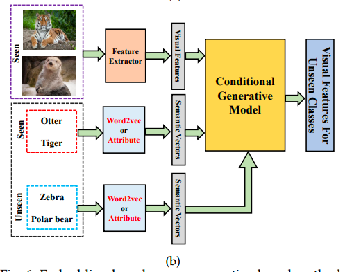
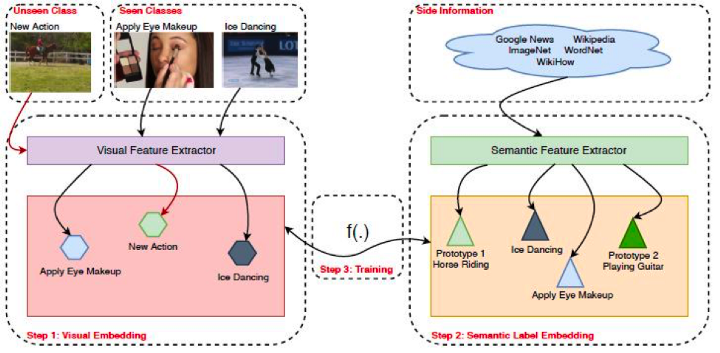

> Keyword : Transfer learning, Zero-shot learning

### Transfer learning이란
- 머신러닝 모델이 특정 도메인에서 얻은 지식 및 정보를 다른 도메인(분야)에서 문제를 해결하는데 사용하는 방식
- A라는 문제의 해답이 a면, 다른 도메인의 B라는 문제를 해결할 때 공통점을 분석해서 b라는 답을 풀어낼 수 있음

### Zero-shot learning이란
- Transfer-learning의 한 종류라고 할 수 있음
- Training 과정에서 관측된 여러 데이터 class 외에, 새로은 class에 속하는 데이터를 스스로 학습하는 모델
- 한번도 본적 없기에 zero-shot이 됨
- 예를 들어, 말 데이터를 학습한 모델이 얼룩말 데이터에 대해 '얼룩말'이라고 답을 맞힐수 있는 기술

### 원리

- 이미지로부터 semantic feature, visual feature를 모두 추출하여 mapping function에 대응됨
- 이 mapping function은 관측된 class와 멀어진 정도를 측정하여, error값이 최소가 되는 값을 unseen class로 측정

## Reference
- https://en.wikipedia.org/wiki/Zero-shot_learning
- https://medium.com/analytics-vidhya/zero-shot-action-recognition-in-videos-a-survey-793cdfafbf1b