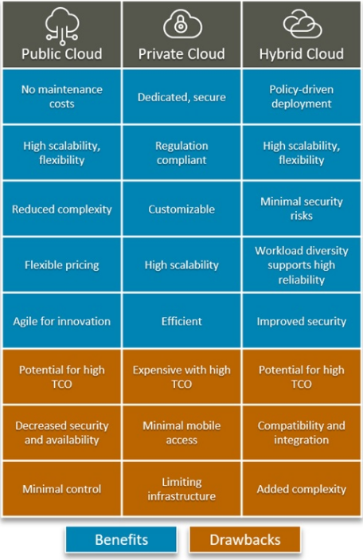
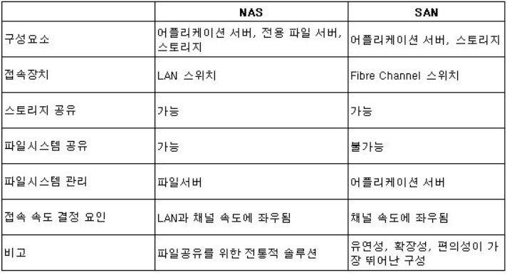

## Table of Contents
3. [IaaS, PaaS, SaaS](#iaas-paas-saas)
    - [IaaS](#iaas)
    - [PaaS](#paas)
    - [SaaS](#saas)
4. [Public Cloud, Private Cloud, Hybrid Cloud](#public-cloud-private-cloud-hybrid-cloud)
    - [public cloud](#public-cloud)
    - [private cloud](#private-cloud)
    - [Hybrid Cloud](#hybrid-cloud)
5. [DAS, SAN, NAS (Storage)](#das-san-nas-storage)
    - [DAS](#das)
    - [SAN](#san)
    - [NAS](#nas)

## 용어정리
Server(서버) : 컴퓨터 프로그램 또는 장치.  네트워크를 통해 클라이언트로부터의 정보를 받아 처리 및 응답하는 서비스를 제공하는 컴퓨터 시스템
Storage(스토리지) : 쉽게 말해 저장소를 의미
Network(네트뭐크) : 연결을 통해 컴퓨터 자원 공유하는 것, 또는 그런 체계
Web(웹) : 인터넷의 한 종류로서, 인터넷에 연결된 사용자들이 서로의 정보를 공유할 수 있는 공간.
third-party(서드파티) : 클라우드 서비스를 제공하는 제 3사를 의미합니다.
middleware(미들웨어) : 양 쪽을 연결하여 데이터를 주고받을 수 있도록 중간에서 매개 역할을 하는 소프트웨어 ex) 웹브라우저로부터 데이터를 저장할 수 있게 해주는 DB시스템
hosting(호스팅) : 제공자등의 사업자가 개인용 홈페이지의 서버 기능을 대행하는 것. 또 기업의 대용량 메모리 공간을 이용하여 사용자의 홈피나 웹 서버 기능을 대행하는 서비스.
TCO(Total Cost of Ownership) : 서버 도입 및 유지/보수에 들어가는 컴퓨팅 시스템의 총비용. 

## IaaS, PaaS, SaaS
aaS : as-a-Service 를 의미하며, 클라우드 기반 서비스를 지칭할 때 쓰이는 말입니다.

### IaaS
 **infrastructure**-as-a-Service 를 의미하며, 서드파티 업체가 제공하는 고도로 자동화되고 확장 가능한 인프라를 의미합니다.
이 인프라에서는 스토리지, 호스팅, 컴퓨팅, 네트워킹 등이 포함되어 있고, 비용은 사용한 만큼만 지급하게 됩니다.
따라서 기업은 IaaS 를 통하여 IT자산(소프트웨어 서버, 라이센스)등을 직접 소유하는 대신
필요에 따라 리소스를 유연하게 대여할 수 있습니다.
**AWS** 가 이 시장을 40% 점유하고 있다는 점이 주목할 만합니다.
### PaaS
 **Platform**-as-a-service 를 의미하며, **IaaS + 개발툴과 기능, 앱배포 등의 플랫폼 전반적인 영역**을 제공하기에 가장 까다로운 영역입니다.
반대로 서비스를 이용하는 개발자의 입장에서는, 기반 infrastructure를 provisioning 할  필요가 없어집니다.
주로 대형 IT기업에서 볼 수 있고, 구글 앱엔진, 오라클의 클라우드 플랫폼 등이 있습니다.

### SaaS
 **Software**-as-a-service 를 의미하며, Third party가 **hosting 방식**으로 소프트웨어를 제공하는 것을 지칭합니다. **웹을 통해 로그인하면 사용**할 수 있고, **구독 형식**으로 과금되는 것이 일반적입니다.
특장점은 머신 혹은 서버를 기준으로 소프트웨어 라이센스를 구매하기 때문에, 설치할 필요 없이 웹에서 사용이 가능합니다.
필요할 때 비용만 내면 얼마든지 사용이 가능하며, 사용자가 일일이 패치, 업그레이드 할 필요가 없다는 것도 장점입니다.
ex) 이메일, CRM software, 구글 독스 

### 정리
 - SaaS -> IaaS -> PaaS 로 서비스 자원 제공 범위가 확장되는 개념
 - 최초 Cloud 서비스는 지메일, 드롭박스, 네이버 클라우드 처럼 Software 를 App에서 쓸 수 있는 SaaS 가 대부분이었음 
 - 이후 서버와 스토리지, 네트워크 같은 인프라 장비를 빌려주는 IaaS, 그리고 플랫폼을 빌려주는 PaaS로 발전

## Public Cloud, Private Cloud, Hybrid Cloud

출처 : https://www.bmc.com/blogs/public-private-hybrid-cloud/#
### Public Cloud
장점
- **인터넷을 통해 전달되고 조직 간에 공유가 가능한 저장소**
- 유지비용 없음
- 복잡하지 않고 flexible함
단점
- 보안의 문제가 있음
- customizing이 어려움
### Private Cloud
- 말 그대로 **개인 저장소**
장점
- customizing가능
- 효율적이고 보안에 강함
- 
### Hybrid Cloud
- public 과 private 을 둘 다 쓰는 환경
- 각각의 장단점이 보완된 형태

## DAS, SAN, NAS (Storage)
**Storage system** 이란?
  - 단일 디스크로 처리할 수 없는 용량을 저장하기 위해 디스크를 묶어서 논리적으로 사용하는 기슬
  - 데이터 범람으로 인해 효율적인 저장과 관리에 대한 수요가 급증하였고, 정보 자원을 저장하는 방법론은 하나의 기술로서 자리 잡게 되었음

### DAS
 - **Direct Attached Storage**의 약자로, 시스템에 직접 붙이는 외장 storage를 의미(외장하드 등)
 - 전용 연결장치가 있으므로 NAS 보다는 Access 속도가 빠르지만 시스템에 1대1로밖에 적용이 안되는 단점
### SAN
 - **Storage Area Network** 의 약자로, 서로 다른 종류의 저장장치를 관련 데이터 서버와 함께 연결해 별도의 랜(근거리통신망)이나 네트워크를 구성해 저장공간 관리
 - 서로 다른 저장장치가 함께 연결되어 있어서 모든 사용자들이 공유 가능
 - 백업, 복원, 영구보관 및 검색이 가능하고 한 저장장치에서 다른 저장장치로 데이터를 이동시킬 수 있다는 장점이 있다
 - 별도의 네트워크 서버를 구축해야 한다는 단점이 있음
### NAS
 - **Network Attached Storage**의 약자로, 파일서버의 한계를 극복한 파일공유를 위한 전통적 솔루션
 - 네트워크에 붙어있기 때문에 셋팅이 쉬움
 - 파일 공유에 큰 장점 - 파일시스템 공유 가능
 - LAN과 채널 속도에 성능이 좌우된다는 단점이 있음

### 정리
- DAS-NAS-SAN 순으로 점진적으로 확장되는 개념

## Reference
1) aaS : https://m.blog.naver.com/PostView.naver?isHttpsRedirect=true&blogId=futuremain&logNo=221360648846
2) DAS, SAN, NAS : https://blog.naver.com/gojump0713/140111144418

