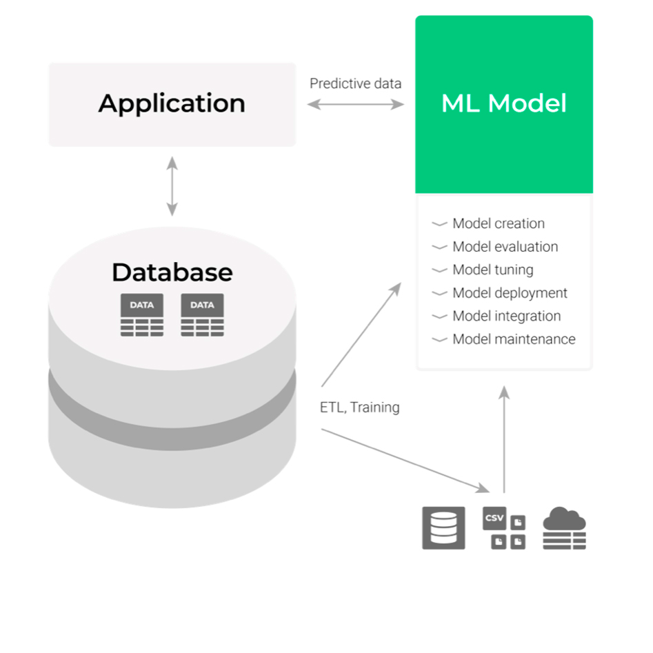

> Keyword : Transfer learning, Zero-shot learning



## ORM VS ODBC
- ORM(Object Relational Mapping) : Python class를 이용하여 dB와 상호작용 가능
- ODBC(Open Database Connectivity) 
  - 개발자가 원시 또는 기본 SQL 쿼리를 작성하여 DB와 직접 상호작용 가능
  - DB system(oracle, Mysql, ...)에 관계없이 접근 가능

### 별도의 서버가 필요할까?
- 메모리 이슈가 있는 것 같긴 한데 같은 서버에서 운용하는 것 자체가 쿤 문제는 아닌 것 같음

### [pyodbc](https://mkleehammer.github.io/pyodbc/)
- ODBC db를 간단하게 접근할 수 있는 open source python module

## 1. pyodbc 설치

## ORM VS ODBC

- ORM(Object Relational Mapping) : Python class를 이용하여 dB와 상호작용 가능
- ODBC(Open Database Connectivity)
    - 개발자가 원시 또는 기본 SQL 쿼리를 작성하여 DB와 직접 상호작용 가능
    - DB system(oracle, Mysql, ...)에 관계없이 접근 가능


# ODBC 실습
> [Microsoft 공식 문서](https://learn.microsoft.com/ko-kr/sql/connect/python/pyodbc/python-sql-driver-pyodbc?view=sql-server-ver16)를 참고하였습니다. 


## 2. 설치 과정

1. Microsoft ODBC 드라이버 설치
2. pyodbc 설치

    ```python
    sudo -H pip install pyodbc
    ```


## Reference
- https://mindsdb.com/blog/self-service-machine-learning-with-intelligent-databases