# GOAL
- Data-Driven Approach로 image classification을 진행하게 된 배경을 이해합니다.
- 이미지를 어떻게 비교 및 분류하는지 알아보고, **KNN(K-Nearest Neighbor)**에 관하여 이해합니다.
- 이미지를 분류하는 Linear 한 모델에 관하여 가볍게 이해해 봅니다.

# Table of Contents
1. [Image Classifciation](#image-classification)
2. [Data-Driven Approach](#data-driven-approach)
3. [Distance Metric](#distance-metric)
    - [L1, L2 Distance](#L1,-L2-distance)
    - [K-Nearest Neighbor](#k-nearest-neighbor)
    - [Hyperparameter](#hyperparameter)
4. [Linear Classifier](#linear-classifier)
    - [Limitations](#limitations)

## Image Classification
 Computer Vision에서 Image Classification은 매우 핵심적이고 근본적인 작업입니다. 하지만 우리가 직관적으로 인식하는 것이랑, 컴퓨터가 인식하는 것이랑은 차이가 있죠. 컴퓨터는 모든 것을 숫자로 받아들이기 때문입니다. 우리는 이것을 'Semantic Gap(의미론적 차이)'라고 표현하며, 아래 그림을 보며이해해 보겠습니다.  
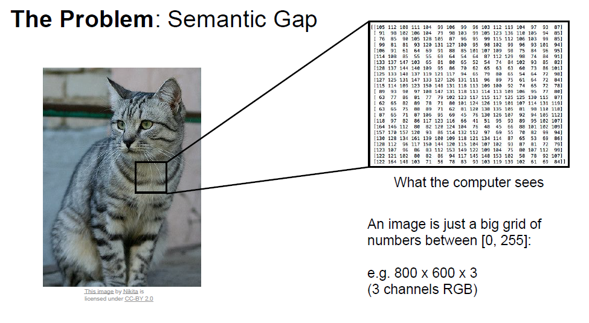
컴퓨터에서 이미지는 기본적으로 0~255사이의 pixel로 표현되며, 3개의 channel의 matrix형태로 표현됩니다.  
 -> 이런 숫자로부터 우리는 **'이 사진이 고양이다'라는 의미를 추출해 내고 싶은 게 목적**입니다.
하지만 빛, 변형, 보호색, 개체의 변형 등 많은 Hurdle이 존재하기에, 명백한 방법이 없었죠. 가장자리 모서리를 따라 outline을 만들어내며 추출하는 시도들이 있었지만 쉽지 않았습니다.
그래서 고안된 방법이 Data에 기반한 접근법입니다.

## Data-Driven Approach
간단한 순서는 다음과 같습니다.

1. 이미지와 label(이미지의 정답)정보가 포함된 dataset을 모으고
2. 머신러닝으로 training 시키고
3. 새로운 이미지에 대한 classifier(분류기)를 평가해 보는 것
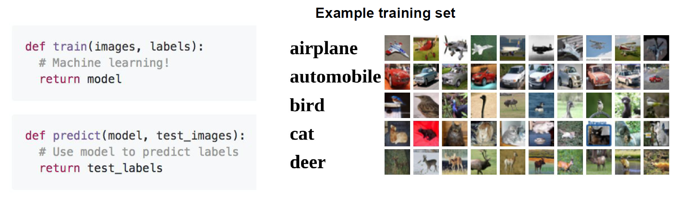

-> training set을 label과 함께 학습하면, 그 이후의 새로운 이미지에 대하여 분류를 통해 의미를 추출해 낼 수 있는 것이죠.
그렇다면 어떻게 기존 학습된 데이터와 새로운 이미지를 비교할 것이냐? 하는 의문이 제기되는데,
기본적으로 새로운 이미지와 기존 학습된 이미지 간의 거리를 재어 가장 거리가 가까운 이미지를 고르게 됩니다.
이것을 nearest neighbor(가장 가까이 있는 이웃)방법이라고 합니다.  
아래 그림은 nearest neighbor에 대해 10개의 class에 따라 각각 예측이 되는 과정을 보여줍니다.

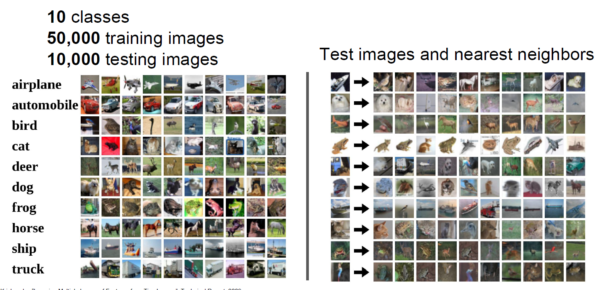

## Distance Metric
 가깝고 먼 거리(Distance)를 측정하려면 기준이 필요합니다. 강의에서는 아래 두 가지 기준을 설명해주고 있습니다.
### L1, L2 Distance
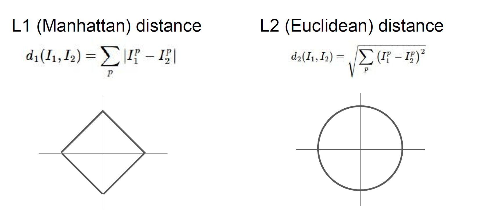

L1 distance : 각 pixel값의 차이를 구한 후 결괏값을 합산하는 방법  
L2 distance : 각 pixel값의 차이를 제곱한 후 root를 씌운 후 결괏값을 합산하는 방법

* L2 distance는 root를 씌우지 않는 것으로 정의되기도 합니다.
* L1과 L2 distance와 관련한 추가적인 이해는 [링크](https://junklee.tistory.com/29)를 참고해 주세요.

L1 distance 방법을 통하여 거리를 계산한 아래 예시를 보며 이해해 봅시다.

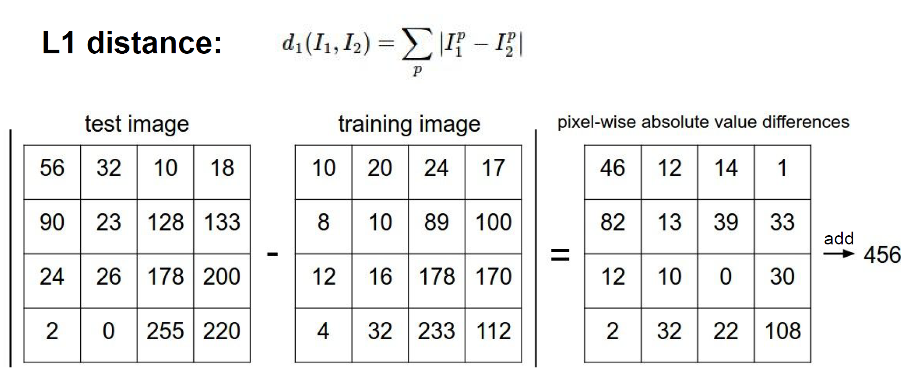

### K-Nearest Neighbor
 한마디로 가장 가까운 K개를 비교해 보자! 입니다. k=5라면, 가장 거리가 가까운 5개중에서 다수결로 예측을 진행하는 것이에요!
아래 코드를 살펴보며 이해해 볼까요?
{gist}

하지만 이는 단점이 있습니다. 
1. 전체 학습된 데이터셋과 비교하기 때문에 너무 느리고,
2. outlier에 강건하지 못합니다.  
아래 그림을 보시죠!
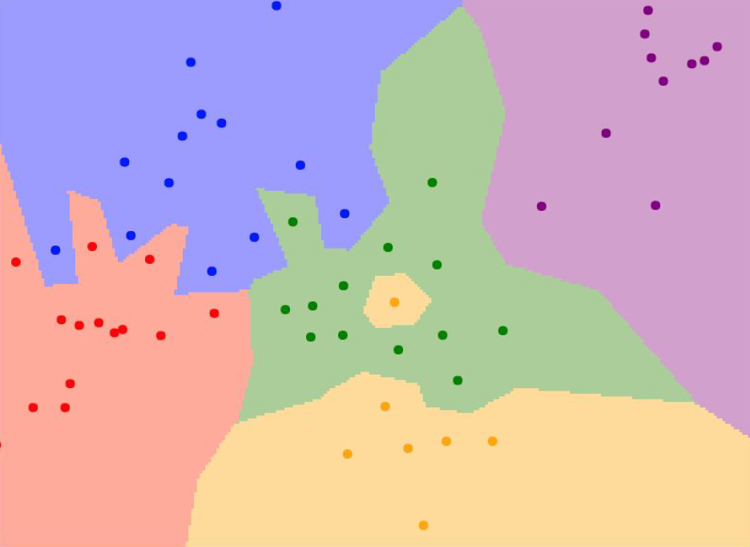
점들은 각각의 data를 의미하고, 색깔은 KNN에 의해 분류된 결과를 의미합니다.
예를 들어, 초록색이 고양이를 의미하고 노란색이 강아지를 의미한다면, 초록색 영역 안에 포함된 data들이 고양이로 분류된 것이죠.
하지만 조금 이상한 점은, 중간에 섬처럼 떨어져 있는 노란색 지점입니다. 초록색으로 분류되는 것이 자연스러움에도 불구하고, distance가 더 가깝다는 이유만으로 강아지로 분류된 것입니다. 실제로 data를 확인해 봤을 때, 이것은 고양이일 확률이 높고, KNN 알고리즘이 잘못 예측하였을 확률이 높습니다.
(다시 말해, 강아지라고 학습된 데이터와 거리가 가깝다는 이유만으로, 실제로 고양이로 분류되는 것이 더 적절함에도 강아지로 분류된 것입니다.)
이러한 단점 때문에 KNN은 거의 사용되지 않습니다. 이는 또한 **차원의 저주** 개념과도 연관되어 있는데, 이는 나중에 다루도록 하겠습니다.

추가로, K의 수에 따라 분류 성능 및 결과도 달라지게 되는데, [링크](http://vision.stanford.edu/teaching/cs231n-demos/knn/)에서 실험해보면서 이해해 보시기 바랍니다!

### Hyperparameter
그렇다면 최적의 K값은 어떻게 설정할 수 있을까요? 또, 어떠한 기준으로 거리(distance)를 측정하는 것이 보다 나은 성능을 안겨줄까요?
그것은 우리가 모델을 직접 돌려가면서 가장 좋은 성능이 나올 수 있게 조정을 해주어야 합니다(problem-dependent).  
알고리즘 및 모델에 따라 이러한 기본적인 setting에 필요한 값을 우리는 **hyperparameter**라고 부릅니다!

이것은 모델이 자체적으로 학습하고 update하는 parameter와 대비됩니다. 이것에 대한 설명은 많이 할 수 있는 기회가 있을 것입니다.

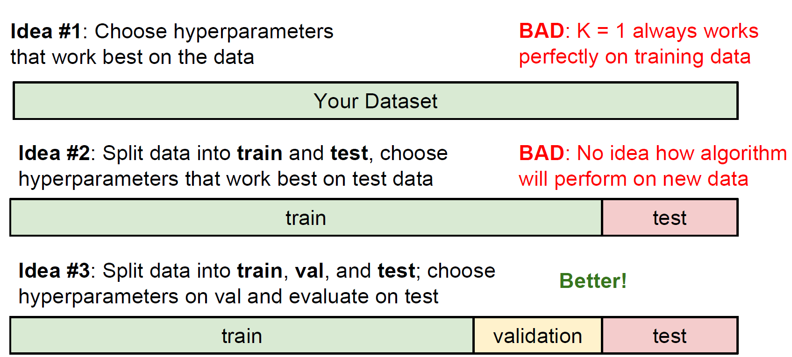
Hyperparameter는 총 dataset을 training, validation(생략되기도 함), test set 이렇게 세 가지로 나누어 학습을 진행하면서 조정됩니다.  
**분류 모델링 시 기본이 되는 구조**이니 잘 기억해 두시면 좋습니다!

> ### Tip🥳
> 위 슬라이드를  
> - trainset = 시험공부 범위  
> - validation set = 모의고사  
> - test set = 수능 시험  
> 이라고 생각하고 한 번 이해해 보시기 바랍니다!

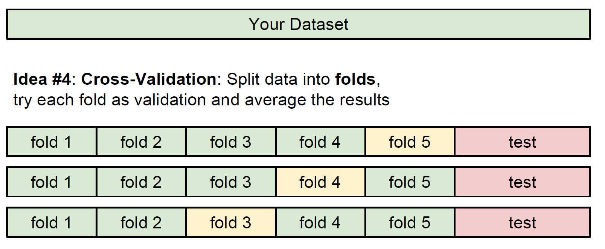

이와 달리 trainset을 여러 Fold(subset)으로 나누어 검증(validation)하는 방법도 있습니다. 각 Fold별로 결과를 평균내어 산출합니다. 검증을 여러 번 시도할 수 있는 장점이 있겠네요!

## Linear Classifier

우리는 어떻게 이미지 간 유사도를 측정하고, 이미지에서 의미를 뽑아내어 분류하는지 그 방법에 대하여 배웠습니다. 그것에 기반하여 실제 분류를 하는 작업을 살펴봅시다.  
10개의 class로 분류하는 작업이며, 50,000개의 trainset과 10,000개의 testset으로 이루어져 있는 [CIFAR10](https://www.cs.toronto.edu/~kriz/cifar.html) datset입니다.

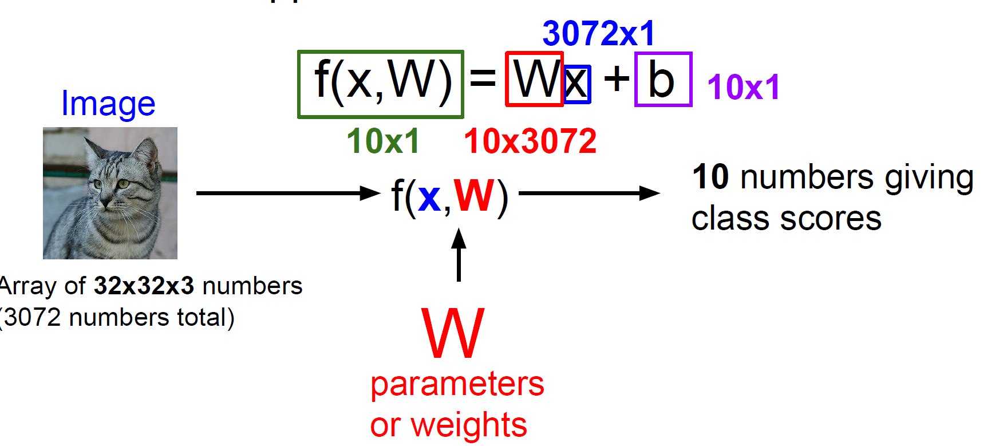
고양이 image를 input(x)으로 넣으면, 우리가 설정한 모델(f(x,W))의 연산에 의해 10개의 class 에 대한 각각의 score(점수)를 output으로 확인하게 됩니다. 
이 점수가 가장 높은 class로 모델은 예측을 하게 되는 것이죠!  
여기서 W는 Weight 또는 Parameter라고 하며, input으로부터 output을 반환해 주는 가중치의 역할을 하는 매우 중요한 개념입니다.  
여기서 b는 결괏값을 우리가 원하는 모델로 근사하도록 조정해주는 값입니다. 이는 Lecture 3 에서 자세히 다뤄보겠습니다.  
아래 슬라이드를 보며 제가 설명한 내용을 이해해 보시면 좋을 것 같습니다!

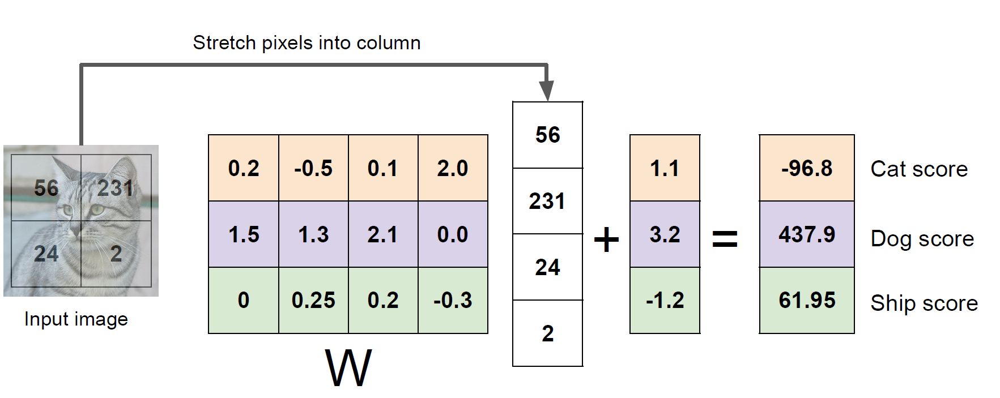

결과적으로, linear한 모델로부터 아래 그림과 같이 분류 작업이 이루어지게 됩니다.
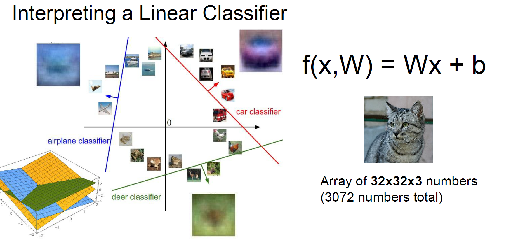

### Limitations
1. 비선형 모델링이 어렵습니다. 아래 그림과 같이, 비선형한 함수로부터 만들어진 class로 분류작업을 진행할 수 없죠.
   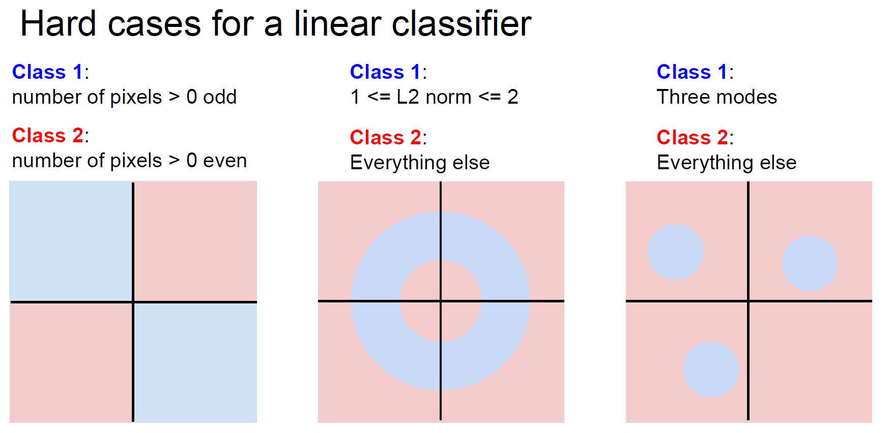
2. **parameter를 스스로 update하지 못합니다.** 우리는 이것이 좋은 모델인지 아닌지 그저 결과만 보고 판단하는 수밖에 없으니, 일일이 모델의 parameter W를 수정해 주어야 하는 것이죠.
   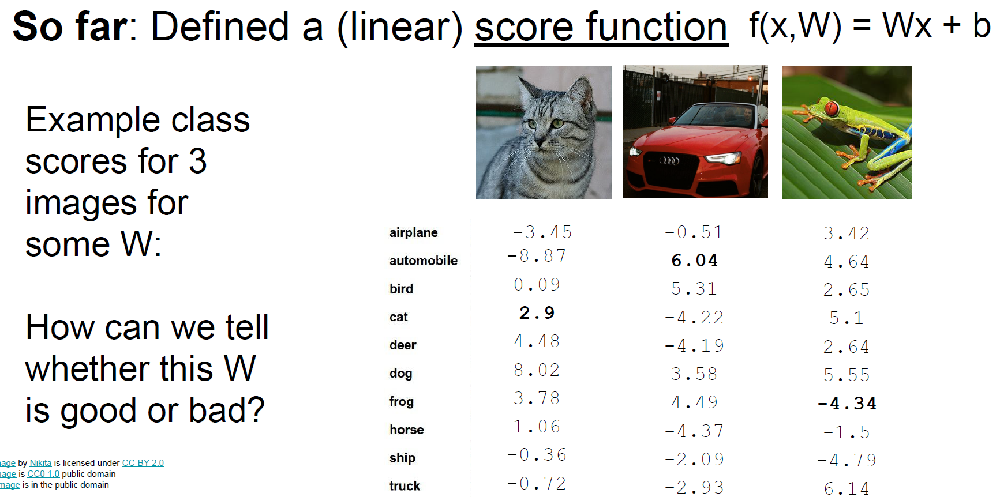

이러한 의문을 갖고 다음 강의에서 어떻게 모델을 최적화(optimize)하는지 배워보겠습니다.

> ##회고😎
> - 이미지의 의미론적인 정보를 추출하기 위해 data-driven approach가 고안되었고, 이는 training set을 머신러닝 기법으로 학습하는 것이다.
> - KNN으로 K개의 가장 distance가 작은 image와의 비교를 통해 새로운 이미지를 분류 가능하지만, 잘 쓰이지는 않는다.
> - linear한 classification은 모델 최적화에 어려움이 있다. 

### 생각해 볼 문제!
- hyperparameter를 처음에 값을 정하는 근거가 필요해요. 처음에 어떻게 정할까요?
- k-fold validation은 왜 작은 dataset에만 유용할까요?
- linear classification에서 linear의 의미는 무엇일까요?

## Reference
- CS231n Lecture 2 : https://youtu.be/OoUX-nOEjG0
- CS231n Lecture slide : http://cs231n.stanford.edu/slides/2017/cs231n_2017_lecture2.pdf

