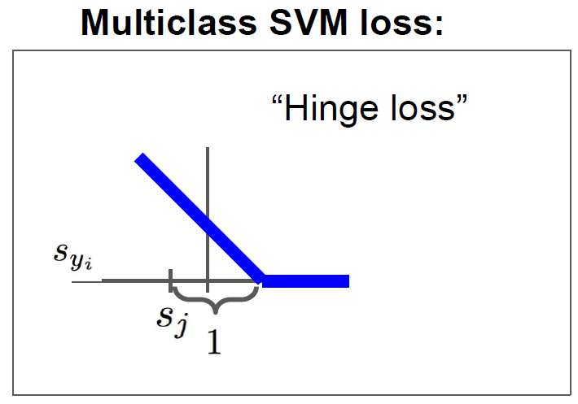
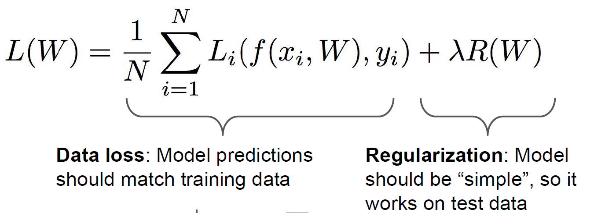

# GOAL
1) 시각화를 통해 CNN의 feature를 이해하는 방법론들을 activation과 gradient의 관점에서 알아본다.
2) 이미지 Style을 변형시키는 방법에 대해 알아본다.

# Table of Contents
1. [Deepdream](#example)
2. [Feature Inversion](#example2)
3. [Texture Synthesis](#third-example)
   - [Gram Matrix](#example4)
4. [Style Transfer](#fourth-examplehttpwwwfourthexamplecom)

## Deepdream
[위키백과 : Deepdream](https://en.wikipedia.org/wiki/DeepDream)
[이미지 사이트 체험](https://deepdreamgenerator.com/)
- Google 에서 만든 재미용
- network의 중간에 **특정한 neuron activation을 Amplify(증폭)**  

-> 네트워크가 이미 뽑아낸 특징들을 더욱 증폭시키는 역할

- 원리
  1) forward 방향으로 activation 계산 (여기까진 일반적 네트워크와 같음)
  2) layer의 **_activation 과 같은_ gradient를 설정** 
  3) Backward 방향으로 gradient 계산 (backprop)

- 결과를 위해 조정한 사항들  
  1) Jitter : 이미지를 두 픽셀씩 옮김
  2) Normalize ascent to gradient 
  3) Clip pixel values :최대,최솟값으로 제한

-> training 되었던 image들의 feature들이 input image에 함께 뒤섞여 나타남

## feature Inversion

이미지의 CNN feature Vector 가 주어졌을 때
  1) 자연스럽고
  2) 그 feature vector 가장 잘 부합하는
이미지 output return

주어진 feature vector와
새로운 이미지의 feature와의 L2 distance 측정 
Regularization 진행 후 최솟값을 return

- VGG16의 각기 다른 layer로부터 feature inversion 진행 결과,
    -> 얕은 layer보다는 깊은 layer에서 더 새로운 output이 탄생함을 알 수 있다.

## Texture Synthesis
- Sample patch(이미지 일부)로부터 같은 texture의 더 큰 이미지 합성하는 방식
- nearest neighbor 알고리즘으로 '복붙'하면 깨짐 현상이 있음

### Gram matrix
- image의 질감을 표현하는 행렬, 이를 통해 text synthesis 진행

- 원리
  1) image input을 CNN에 넣으면 C*H*W tensor가 출력됨
  2) 이 tensor 중 2개의 C차원 vector를 외적하면 C*C의 co-occurence를 표현하는 matrix가 나오는데 이것이 바로 Gram matrix
  3) 마치 correlation을 판단하는 행렬 -> 질감의 유사도를 측정 가능!

### Gram matrix 이용한 합성과정

1) 하나는 input으로부터, 하나는 Noise로부터 이미지를 생성
2) Gram matrix 추출 후 Gram matrix 간에 L2 distance의 가중합, 즉 Loss 계산
3) Gradient 계산을 위한 Backprop 및 parameter update(make gradient step)
4) 2)~3) 반복

- 이 기법 역시 깊은 Layer로부터 더 많은 feature들이 추출됨을 알 수 있다.

## Style Transfer
비슷한 방법으로 두 이미지의 texture 차이를 최소화함으로서 특정 이미지의 분위기 합성이 가능
-> Style transfer
- Gram matrix값 최소화시키면서 생성하는 이미지 기법

### Content image, Style image
1) content image로부터 feature reconstruction
2) style image로부터 gram matrix reconstruction

### 특징
1) Fine control 가능(style image 크기 조정 등)
2) 너무 느림. 

### Fast style Transfer

1) style을 미리 학습시킴
2) content image만 넣어서 학습
-> 속도 향상
   ** batch normalization보다 instant normalization 에서 더 큰 상승 효과
3) segmentation network는 여러 층으로 transposed convolution 이용해서 down,upsampling

### Deepdream website에서 Style transfer 통해 쇠라풍 그림으로 교체한 사진 

### Reference
- CS231n 12강 Lecture Note : http://cs231n.stanford.edu/slides/2017/cs231n_2017_lecture12.pdf
- https://inhovation97.tistory.com/28