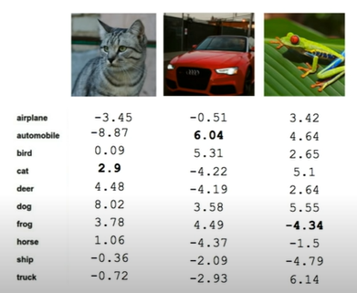
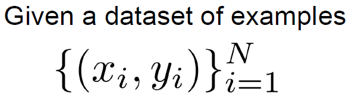
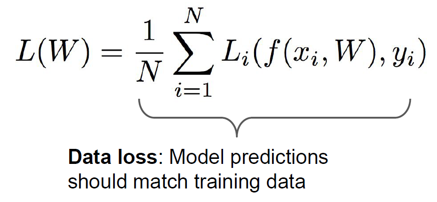

# GOAL
- parameter를 Loss function을 통해 update하는 *optimization* 과정을 이해합니다.
- Gradient descent 과정을 개괄적으로 이해합니다.

# Table of Contents
1. [Loss function](#loss-function)
   - [Multiclass SVM Loss](#multiclass-svm-loss)
   - [Regularization](#regularization)
   - [Softmax function](#Softmax-function)
2. [Optimization](#optimization)
   - [Stochastic Gradient Descent](#stochastic-gradient-descent)

## Loss function
   지난 시간에 우리는 Parameter를 update, 즉 최적의 가중치를 찾아내는 방법에 대한 필요성을 느꼈습니다.
한 마디로 이번 강의에서 설명할 최적화(Optimization)에 대한 이야기입니다. 그리고 그를 위한 핵심 개념인 손실 함수(Loss function)에 대하여 우선적으로 알아보겠습니다.

### What is loss function?
 Loss function(손실 함수, 이하 한글 용어 생략)은 다른 말로 Cost function이라고 합니다.
Loss 또는 cost를 계산하는 함수다! 이렇게 예상이 되네요.
그리고 그러한 손실(또는 비용)이 줄어드는 것이 더 바람직한 방향이라는 감까지 오셨다면
Loss function에 대한 직관은 이미 반 정도 익히신 것으로 생각되네요. 조금더 자세히 들어다 볼까요?

우리는 위와 같은 이미지 분류 문제에서 진짜 class(label 또는 정답)에 해당하는 score가 가장 높은 점수가 나오도록 모델을 만들고 싶어요.
그래야만 새로운 이미지도 올바른 정답으로 판단할 확률이 높을 테니까요. 우리는 이것은 정확도(accuracy) 등의 지표로 판단하게 됩니다.
하지만 그림을 보면 고양이의 정답을 가진 사진은 deer(사슴)에 해당하는 가장 높은 점수를 갖고 있고, 개구리는 truck(트럭)에 해당하는 점수를 가장 높게 갖고 있네요.

수치로 표현된 이러한 점수(score)들이 얼마나 바람직한지, **정량적으로** 어긋난 정도를 판단할 필요성을 느낍니다.
그 벗어난 정도를 알아야 알맞게 가중치를 갱신할 수 있기 때문입니다.
정량적인 수치로 표현해야 하니, 특정한 입력값마다 변하는 하나의 함수가 정의되는 것이고,
그것이 Loss function으로 표현되는 것입니다.

$f(x_i, W)$ : input과 parameter에 의한 예측된 score를 의미합니다.
$y_i$ : label, 즉 정답에 해당하는 score를 의미합니다. 분류 문제에서는 정답의 class가 1, 나머지는 0으로 기록되어 있습니다.

두 값의 차이가 N개의 data별로 각각 존재할 것이고, 그것을 평균낸 값을 우리는 $L(W)$로 정의하는 것입니다. 
$W$, 즉 parameter가 독립변수로 존재하는 함수이니, 이 값에 따라 Loss function의 결괏값도 달라지지라는 것을 직관적으로 이해할 수 있습니다.

이러한 Loss function의 예시인 Multiclass SVM Loss 를 살펴보며 이해도를 높여 보겠습니다.

### Multiclass SVM Loss

 이전에 편의상 score라고 표현한 예측값이 여기서 정식으로 정의됩니다.
그리고 $L_i$는 다음과 같이 정의돼요!

$$
L_i = \underset{j\not=y_i}\sum
\begin{cases}0 \qquad\qquad if\quad s_{y_i}\geq s_j + 1\\s_j - s_{y_i} + 1\quad \: if\quad otherwise
\end{cases}
$$
$$
= \underset{j\not=y_i}\sum max(0,s_j - s_{y_i} + 1 )
$$
### Regularization

### Softmax function

## Optimization
### Stochastic Gradient Descent

